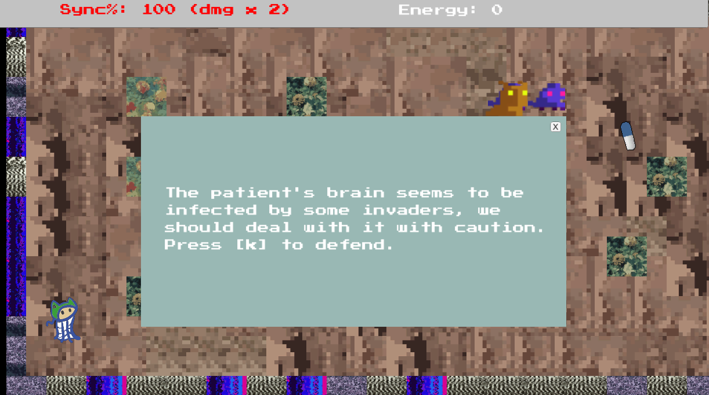

# Basilisk

A roguelike game for GameOff 2018 ([released!](https://knh190.itch.io/basilisk)). 

Your brain is invaded by a troop of robots. The more abilities you get, the more enemies learn.

## Keyboard

* Move: `WASD`
* Attack: `k`
* Cure: `1`
* Stun: `2`
* Bomb: `3`

## Theme

"Hybrid"

## Sprites

Made with [pixelator](http://pixelatorapp.com/) and Sketchbook. Enemy sprites from asset store [Pixel Art Enemy Pack](https://assetstore.unity.com/packages/3d/pixel-art-enemy-pack-63314).

## Music

Made with [soundation](http://soundation.com).

